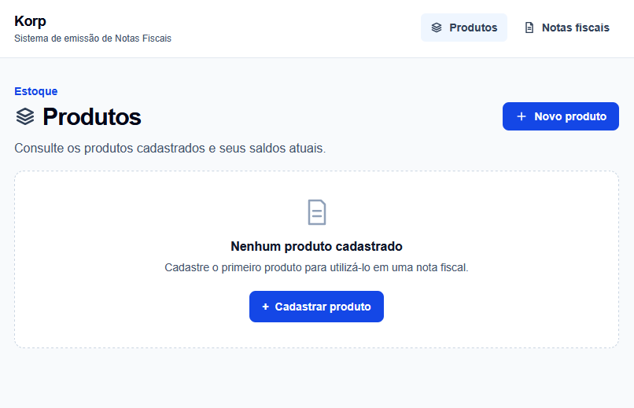
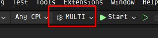

<h1 align="center">
  <br>
  <b>Korp - Emissão de Notas Fiscais</b>
  <br>
</h1>

<p align="center">
  Sistema de emissão de notas fiscais desenvolvido como parte do desafio técnico da <b>Korp</b>.
</p>

<p align="center">
  <a href="#sobre">Sobre</a> •
  <a href="#tecnologias">Tecnologias</a> •
  <a href="#como-rodar-o-projeto">Como Rodar</a> •
  <a href="#testes">Testes</a> •
  <a href="#arquitetura">Arquitetura</a>
</p>

<div align="center">
  
</div>

## Sobre

Este projeto foi desenvolvido como parte do desafio técnico da **Korp** e representa uma solução para emissão de notas fiscais integrada ao controle de estoque.

A aplicação foi estruturada com separação entre os contextos de **Estoque** e **Faturamento**, cada um possuindo sua própria API e banco de dados, além de uma aplicação web desenvolvida em Angular.

O projeto busca demonstrar boas práticas de desenvolvimento, organização arquitetural, separação de responsabilidades, tratamento padronizado de erros, persistência de dados e execução isolada dos serviços por meio de containers.

## Tecnologias

Principais tecnologias utilizadas no projeto:

* .NET 10
* Entity Framework Core
* SQL Server
* Angular 22
* Docker
* Nginx
* FluentValidation
* xUnit
* Testcontainers

## Índice

* [Sobre](#sobre)
* [Tecnologias](#tecnologias)
* [Como Rodar o Projeto](#como-rodar-o-projeto)
  * [Modo de Desenvolvimento](#modo-de-desenvolvimento)
  * [Modo de Demonstração](#modo-de-demonstração)
  * [Endereços do Ambiente](#endereços-do-ambiente)
* [Testes](#testes)
* [Arquitetura](#arquitetura)

# Como Rodar o Projeto

O projeto pode ser executado de duas formas:

* **Modo de Desenvolvimento:** indicado para desenvolvimento e depuração local dos serviços.
* **Modo de Demonstração:** utiliza Docker Compose para disponibilizar todo o ambiente de forma integrada e reproduzível.

## Modo de Desenvolvimento

### Backend

Para executar o backend durante o desenvolvimento, utilize o **Visual Studio 2026**:

1. Abra a solução no Visual Studio.
2. Selecione o perfil de inicialização **`MULTI`**.
3. Clique em **Start** para iniciar simultaneamente as APIs de Estoque e Faturamento.




### Front-end

A aplicação Angular está localizada no diretório:

```text
src/Web
```

Acesse o diretório e instale as dependências:

```powershell
npm install
```

Em seguida, execute a aplicação:

```powershell
npm run dev
```

Também é possível utilizar diretamente o Angular CLI:

```powershell
ng serve
```

Caso o Angular CLI não esteja instalado globalmente, prefira o comando:

```powershell
npm run dev
```

## Modo de Demonstração

O modo de demonstração foi criado para permitir a execução completa da aplicação de maneira isolada e reproduzível, sem a necessidade de instalar ou iniciar localmente o .NET, Node.js, SQL Server ou os projetos individualmente.

É necessário apenas possuir **Docker** e **Docker Compose** instalados.

O arquivo `docker-compose.full.yml` é responsável por construir e inicializar os cinco componentes principais da solução:

* frontend Angular servido pelo Nginx;
* API de Estoque;
* SQL Server exclusivo do Estoque;
* API de Faturamento;
* SQL Server exclusivo do Faturamento.

Na raiz do repositório, execute:

```powershell
docker compose -f docker-compose.full.yml up -d --build
```

Para verificar o estado dos containers:

```powershell
docker compose -f docker-compose.full.yml ps
```

O ambiente de demonstração utiliza containers, volumes e portas próprias, permitindo que ele permaneça ativo simultaneamente ao ambiente utilizado durante o desenvolvimento local.

Durante a inicialização:

* os bancos de dados passam por verificações de disponibilidade;
* as APIs aguardam seus respectivos bancos antes de iniciar;
* as migrations são aplicadas automaticamente pelas APIs;
* o frontend aguarda as APIs ficarem disponíveis antes de concluir sua inicialização.

Para encerrar o ambiente:

```powershell
docker compose -f docker-compose.full.yml down
```

Caso também seja necessário remover os volumes criados pelo ambiente:

```powershell
docker compose -f docker-compose.full.yml down -v
```

### Endereços do Ambiente

| Componente                  | Endereço                                |
| --------------------------- | --------------------------------------- |
| Aplicação Web               | `http://localhost:4201`                 |
| API de Estoque              | `http://localhost:5237`                 |
| OpenAPI do Estoque          | `http://localhost:5237/openapi/v1.json` |
| Documentação do Estoque     | `http://localhost:5237/docs`            |
| API de Faturamento          | `http://localhost:5093`                 |
| OpenAPI do Faturamento      | `http://localhost:5093/openapi/v1.json` |
| Documentação do Faturamento | `http://localhost:5093/docs`            |
| SQL Server do Estoque       | `localhost:1435`                        |
| SQL Server do Faturamento   | `localhost:1436`                        |

# Testes

Os testes automatizados utilizam **Testcontainers** para disponibilizar as dependências de infraestrutura necessárias durante a execução.

Por esse motivo, é necessário possuir o **Docker instalado e em execução** antes de iniciar os testes.

Os testes podem ser executados diretamente pelo **Test Explorer** do Visual Studio ou pela linha de comando.

Para executar todos os testes da solução:

```powershell
dotnet test
```

Também é possível executar os testes de um projeto específico:

```powershell
dotnet test caminho/do/projeto.csproj
```

Os containers utilizados durante os testes são criados de forma isolada e gerenciados automaticamente pelo Testcontainers.

# Arquitetura

A solução foi estruturada utilizando princípios de **Clean Architecture**, **Domain-Driven Design (DDD)** e orientação a objetos.

Os principais contextos da aplicação são separados em dois serviços:

* **Estoque:** responsável pelo gerenciamento de produtos, saldos e operações relacionadas ao estoque.
* **Faturamento:** responsável pelo processo de emissão e gerenciamento das notas fiscais.

Cada serviço possui seu próprio banco de dados e suas próprias camadas:

```text
Api
Application
Domain
Infrastructure
```

Essa separação busca reduzir o acoplamento entre os componentes, manter as regras de negócio independentes da infraestrutura e facilitar a evolução e manutenção da aplicação.
