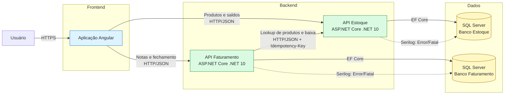
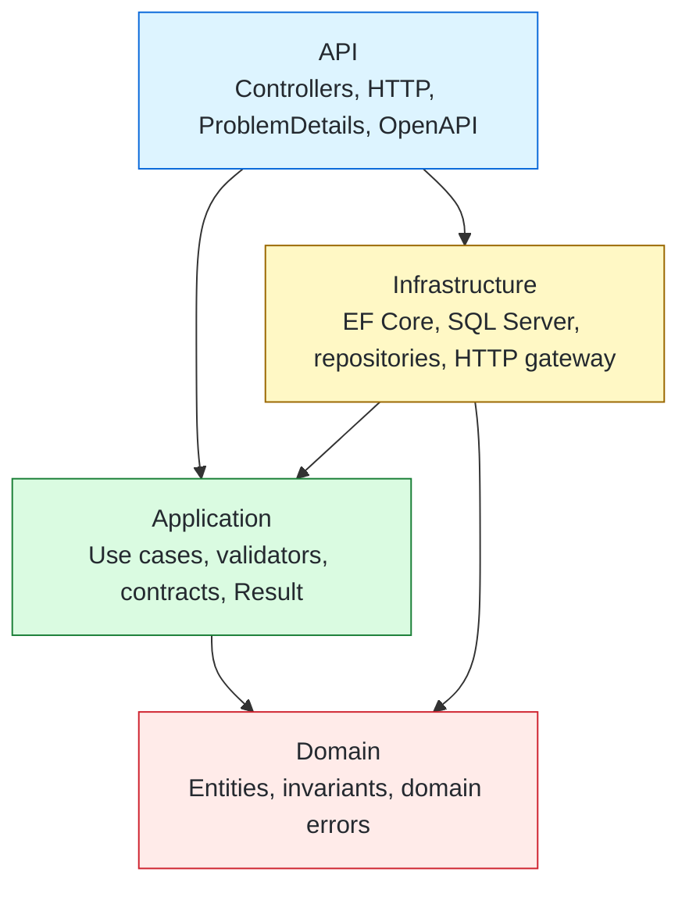
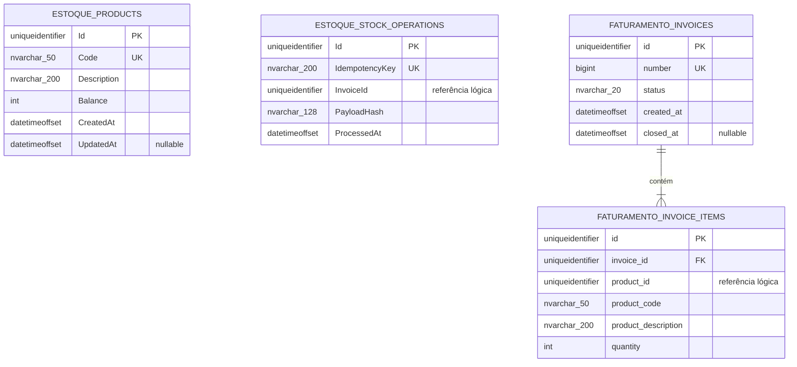

# Arquitetura da solução

## 1. Visão geral

A solução do desafio é composta por uma aplicação Angular e dois microsserviços .NET independentes. O Angular consome diretamente as duas APIs. O Faturamento consulta o Estoque e solicita a baixa por HTTP durante a criação e o fechamento da nota.

> Estado atual: os dois microsserviços, os bancos, a integração e os testes estão implementados. A aplicação Angular representada nos diagramas corresponde à próxima etapa da solução.



## 2. Responsabilidades

### Aplicação Angular

- cadastro e listagem de produtos;
- criação, listagem e consulta de notas;
- acionamento do fechamento pelo botão “Imprimir”;
- indicador de processamento;
- feedback de sucesso ou erro em português;
- impressão pelo navegador somente após o fechamento bem-sucedido.

### Microsserviço Estoque

- cadastrar e consultar produtos;
- manter o saldo de cada produto;
- resolver snapshots de produtos para o Faturamento;
- processar baixa atômica;
- impedir saldo negativo;
- garantir idempotência e segurança sob concorrência.

### Microsserviço Faturamento

- gerar número sequencial;
- criar notas abertas com múltiplos itens;
- armazenar código e descrição do produto como snapshot;
- listar e consultar notas;
- coordenar a baixa com o Estoque;
- fechar a nota somente depois da confirmação do Estoque;
- manter a nota aberta em falhas e permitir nova tentativa.

## 3. Arquitetura interna dos microsserviços

Os dois serviços seguem a mesma separação lógica:



O Domain não conhece ASP.NET Core, EF Core, SQL Server ou HTTP. A Application coordena regras e declara portas. A Infrastructure implementa persistência e comunicação externa. A API realiza composição, model binding e tradução HTTP.

## 4. Fluxo de fechamento da nota

```mermaid
sequenceDiagram
    actor Usuario as Usuário
    participant Angular
    participant Faturamento
    participant Estoque
    participant DBE as SQL Estoque
    participant DBF as SQL Faturamento

    Usuario->>Angular: Clica em Imprimir
    Angular->>Faturamento: POST /api/v1/invoices/{id}/close
    Faturamento->>DBF: Carrega nota aberta
    Faturamento->>Estoque: POST /api/v1/stock/debits<br/>Idempotency-Key estável
    Estoque->>DBE: Inicia transação local
    Estoque->>DBE: Registra operação idempotente
    Estoque->>DBE: Atualiza saldos condicionalmente

    alt todos os itens possuem saldo
        Estoque->>DBE: Commit
        Estoque-->>Faturamento: Baixa confirmada
        Faturamento->>DBF: Fecha e persiste a nota
        Faturamento-->>Angular: Nota fechada
        Angular-->>Usuario: Abre impressão do navegador
    else saldo insuficiente ou produto inexistente
        Estoque->>DBE: Rollback
        Estoque-->>Faturamento: Rejeição
        Faturamento-->>Angular: Erro; nota permanece aberta
        Angular-->>Usuario: Feedback em português
    else Estoque indisponível ou timeout
        Faturamento-->>Angular: 503; nota permanece aberta
        Angular-->>Usuario: Informa falha e permite tentar novamente
    end
```

Se o Estoque concluir a baixa, mas a resposta se perder, uma nova tentativa usa a mesma chave. O registro idempotente faz o Estoque retornar a operação anterior sem descontar o saldo novamente.

## 5. Modelo de dados

Não existe chave estrangeira entre os dois bancos. `invoice_items.product_id` e `StockOperations.InvoiceId` são referências lógicas originadas dos contratos HTTP, não relacionamentos físicos entre microsserviços.



### Restrições importantes

No banco do Estoque:

- `Products.Code` possui índice único;
- `Products.Balance` possui check constraint para impedir valor negativo;
- `StockOperations.IdempotencyKey` possui índice único.
- `error_logs` armazena erros técnicos emitidos pelo Serilog.

No banco do Faturamento:

- `invoices.number` possui índice único;
- `invoice_items` possui chave estrangeira para `invoices` com exclusão em cascata;
- `(invoice_id, product_id)` possui índice único;
- `invoice_items.quantity` possui check constraint para aceitar somente valores positivos;
- `invoice_number_sequence` gera a numeração das notas.
- `error_logs` armazena erros técnicos emitidos pelo Serilog.

## 6. Comunicação entre os serviços

O Faturamento utiliza duas operações do Estoque:

- `POST /api/v1/products/lookup`: obtém código e descrição diretamente do proprietário dos produtos;
- `POST /api/v1/stock/debits`: solicita a baixa com a chave `Idempotency-Key`.

O navegador envia somente `ProductId` e quantidade ao criar a nota. Código e descrição são snapshots fornecidos pelo Estoque, evitando confiar em dados descritivos enviados pelo cliente.

## 7. Consistência e falhas

Não existe transação distribuída entre os bancos. A consistência é garantida por:

- transação local atômica no Estoque;
- atualização condicional do saldo no SQL Server;
- índice único para a chave idempotente;
- hash canônico para detectar reutilização incompatível da chave;
- fechamento local da nota somente após confirmação da baixa;
- nota mantida aberta quando o Estoque falha ou rejeita a operação;
- retentativa segura usando a mesma chave.

## 8. Implantação local

O Docker Compose atual inicializa dois containers SQL Server 2022:

- Estoque na porta `1433` com volume próprio;
- Faturamento na porta `1434` com volume próprio.

As APIs são executadas como processos .NET e aplicam somente migrations pendentes quando essa opção está habilitada no ambiente de desenvolvimento. Os testes de integração criam containers SQL Server descartáveis e independentes do ambiente do Docker Compose.
