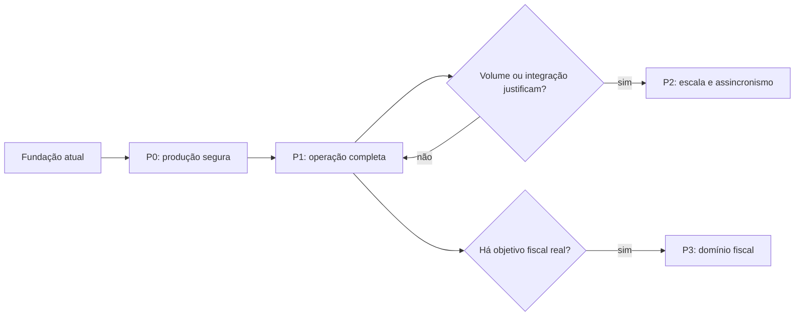

# Plano de evolução

## 1. Propósito

Este documento apresenta uma direção de evolução para o sistema de emissão simplificada de notas e controle de estoque. Ele parte das capacidades já implementadas, identifica riscos que surgiriam em um ambiente produtivo e organiza iniciativas por valor, dependência e urgência.

O plano não representa compromisso de prazo. Cada iniciativa deve ser precedida por validação de negócio, análise de risco, estimativa e definição de critérios de aceite.

## 2. Base atual

A solução já dispõe de uma fundação consistente para o escopo do desafio:

- APIs independentes para Estoque e Faturamento;
- bancos SQL Server separados por contexto;
- aplicação web Angular;
- validações de entrada e invariantes de domínio;
- baixa transacional, atômica e segura sob concorrência;
- idempotência no fechamento de notas;
- numeração única e crescente;
- geração de PDF sob demanda;
- erros padronizados com `ProblemDetails`;
- logs estruturados, limitação de requisições e documentação OpenAPI;
- testes unitários e de integração com SQL Server via Testcontainers;
- execução local e ambiente completo por Docker Compose.

Essa base deve ser preservada. Novas funcionalidades não devem enfraquecer a propriedade dos dados, a atomicidade da baixa nem a idempotência já demonstrada.

## 3. Princípios de evolução

As decisões futuras devem seguir os seguintes princípios:

1. **Valor comprovado:** implementar complexidade somente quando houver necessidade de negócio ou operacional mensurável.
2. **Compatibilidade:** evoluir contratos de forma versionada e evitar mudanças silenciosamente incompatíveis.
3. **Dados sob responsabilidade clara:** Estoque e Faturamento continuam proprietários de seus respectivos dados.
4. **Segurança por padrão:** identidade, autorização, segredos e auditoria devem fazer parte do desenho, não ser correções posteriores.
5. **Operação observável:** novos fluxos precisam de métricas, logs correlacionados, alertas e procedimentos de recuperação.
6. **Entrega incremental:** cada etapa deve produzir resultado verificável, possuir estratégia de rollback e ampliar a cobertura automatizada.

## 4. Prioridades recomendadas

| Prioridade | Horizonte | Objetivo |
|---|---|---|
| P0 | Preparação para produção | Reduzir riscos de segurança, disponibilidade, perda de dados e operação. |
| P1 | Consolidação do produto | Completar fluxos operacionais esperados para estoque e notas. |
| P2 | Escala e integração | Aumentar desacoplamento e capacidade somente quando volume e disponibilidade justificarem. |
| P3 | Expansão fiscal e comercial | Incorporar domínio fiscal e financeiro mediante requisitos especializados. |

## 5. P0 — Preparação para produção

### 5.1. Identidade e controle de acesso

Implementar autenticação e autorização com um provedor de identidade compatível com OAuth 2.0 e OpenID Connect. Definir, no mínimo, permissões separadas para consulta, cadastro de produtos, criação de notas, fechamento e administração.

Critérios de conclusão:

- APIs rejeitam chamadas não autenticadas conforme a política definida;
- permissões são verificadas no servidor, independentemente da interface;
- ações sensíveis registram ator, data, recurso e resultado;
- testes cobrem acesso permitido e negado.

### 5.2. Gestão de configuração e segredos

Remover credenciais de ambientes controlados dos arquivos de configuração e adotar um cofre de segredos ou mecanismo equivalente. Separar configurações por ambiente e documentar rotação de credenciais.

Critérios de conclusão:

- nenhum segredo de produção está versionado;
- credenciais possuem menor privilégio possível;
- rotação pode ocorrer sem reconstruir a aplicação;
- conexões usam criptografia e validação de certificado adequadas ao ambiente.

### 5.3. Ciclo de vida do banco de dados

Em produção, migrations não devem depender da inicialização concorrente das APIs. Criar uma etapa controlada de implantação, além de políticas de backup, restauração e retenção.

Critérios de conclusão:

- migrations são executadas uma vez por pipeline ou job autorizado;
- alterações destrutivas exigem estratégia compatível de expansão e contração;
- restauração é testada periodicamente;
- objetivos de recuperação de dados e de tempo são definidos.

### 5.4. Observabilidade e suporte operacional

Evoluir os logs existentes para uma visão integrada, com correlação entre navegador, Faturamento e Estoque. Adicionar métricas e tracing distribuído, preferencialmente com padrões OpenTelemetry.

Indicadores mínimos:

- taxa e latência de criação e fechamento de notas;
- quantidade de conflitos por saldo insuficiente;
- timeouts e indisponibilidade do Estoque;
- operações idempotentes reconhecidas;
- erros na geração de documentos;
- backlog de inconsistências pendentes de reconciliação.

### 5.5. Resiliência da comunicação

Definir políticas explícitas para timeout, retentativa e circuit breaker na comunicação entre Faturamento e Estoque. Retentativas automáticas de baixa somente são seguras porque a operação possui chave idempotente estável; ainda assim, devem ter limite, backoff e telemetria.

Critérios de conclusão:

- falhas transitórias e permanentes são diferenciadas;
- retentativas não ampliam excessivamente a latência da requisição;
- circuit breaker impede pressão contínua sobre serviço degradado;
- testes simulam timeout, resposta perdida e recuperação.

### 5.6. Integração e entrega contínuas

Criar pipeline reproduzível para build, análise estática, testes, geração de imagens e implantação. Incluir verificação de dependências e de vulnerabilidades, além de manter imagens e pacotes com versões controladas.

Critérios de conclusão:

- toda alteração passa por build e testes automatizados;
- migrations e imagens são artefatos rastreáveis;
- implantação possui health checks e rollback documentado;
- dependências vulneráveis bloqueiam ou sinalizam a entrega conforme política definida.

## 6. P1 — Consolidação do produto

### 6.1. Reconciliação do fechamento

O fluxo atual recupera uma resposta perdida quando o operador tenta novamente. Para operação contínua, é recomendável registrar explicitamente tentativas de fechamento e reconciliar notas abertas cuja baixa já tenha sido confirmada pelo Estoque.

Uma evolução possível é introduzir um estado interno como `closing` ou uma entidade de processo, sem expor conclusões prematuras ao usuário. Um worker pode consultar ou repetir a operação idempotente até determinar o resultado.

Critérios de conclusão:

- nenhuma nota permanece indefinidamente aberta com estoque já debitado;
- a reconciliação é idempotente e auditável;
- falhas irrecuperáveis ficam visíveis para intervenção;
- o comportamento atual de concorrência continua preservado.

### 6.2. Movimentações de estoque

Substituir a visão limitada a saldo atual por um livro de movimentações. Entradas, saídas, ajustes e estornos devem registrar motivo, origem, quantidade, saldo resultante, data e responsável.

O saldo pode continuar materializado para desempenho, desde que seja reconciliável com o histórico e atualizado na mesma transação.

### 6.3. Cancelamento e estorno

Caso o negócio exija cancelamento de nota fechada, o fluxo deve ser modelado como uma nova operação, nunca como exclusão ou simples reabertura. O estorno de estoque precisa de chave idempotente própria, regras de autorização, trilha de auditoria e tratamento de concorrência.

### 6.4. Manutenção de produtos e notas abertas

Adicionar edição de produtos e, se necessário, alteração de notas ainda abertas. Para produtos, deve-se definir se código pode mudar e como o histórico será preservado. Para notas, qualquer alteração deve ocorrer antes do fechamento e manter a proibição de produtos duplicados.

### 6.5. Gestão documental

Avaliar se o PDF deve continuar sendo gerado sob demanda ou se precisa ser armazenado de forma imutável. Requisitos de retenção, assinatura, hash, controle de acesso e descarte devem orientar essa decisão.

## 7. P2 — Escala e integração

### 7.1. Processamento assíncrono

Mensageria deve ser considerada somente se houver necessidade comprovada de absorver picos, reduzir acoplamento temporal ou processar fechamentos fora da requisição HTTP. Nesse cenário, o desenho deve incluir:

- Outbox transacional no produtor;
- consumidores idempotentes;
- correlação e versionamento de eventos;
- política de retentativa e mensagens não processáveis;
- visibilidade do estado do processamento para o operador.

Mensageria não elimina a necessidade de idempotência nem cria uma transação distribuída.

### 7.2. Gateway e proteção de borda

Um API Gateway pode centralizar autenticação, limites, roteamento e observabilidade quando existirem múltiplos consumidores ou mais serviços. Para o tamanho atual, o proxy do ambiente web é suficiente e um gateway dedicado adicionaria custo operacional sem benefício proporcional.

### 7.3. Estratégias de desempenho

Antes de introduzir cache, réplicas ou particionamento, medir consultas lentas, contenção e volume real. Possíveis evoluções incluem paginação das notas, índices orientados por telemetria, cache apenas para leituras tolerantes a defasagem e escalabilidade horizontal das APIs.

## 8. P3 — Expansão fiscal e comercial

Transformar o documento simplificado em uma solução fiscal exige um novo conjunto de requisitos e conhecimento especializado. A evolução pode incluir:

- clientes, endereços, empresas e filiais;
- preços, descontos, totais e condições de pagamento;
- regras tributárias e parametrização fiscal;
- certificado digital;
- geração, assinatura e armazenamento de XML;
- integração com SEFAZ, contingência e consulta de autorização;
- DANFE, cancelamento, inutilização e eventos fiscais;
- adequação à legislação, auditoria e retenção aplicáveis.

Essa etapa não deve ser tratada como simples extensão do PDF atual. Ela representa ampliação substancial do domínio, dos riscos e das responsabilidades legais.

## 9. Sequência sugerida

Ordem recomendada:

1. segurança, segredos, banco, observabilidade e pipeline;
2. reconciliação automática do fechamento;
3. movimentações, estorno e auditoria;
4. melhorias funcionais orientadas por usuários;
5. escala ou mensageria somente após medição;
6. expansão fiscal somente com requisitos legais e especialistas responsáveis.

## 10. Governança do roadmap

Cada iniciativa deve possuir:

- problema e resultado esperado;
- responsável de negócio e responsável técnico;
- dependências e riscos;
- critérios de aceite mensuráveis;
- plano de migração e rollback;
- impacto em contratos, dados, segurança e observabilidade;
- testes automatizados correspondentes;
- decisão registrada quando houver mudança arquitetural relevante.

O roadmap deve ser revisto periodicamente. Itens sem evidência de valor ou sem requisito claro devem permanecer fora do escopo, evitando que a solução acumule complexidade antecipada.

## 11. Métricas de acompanhamento

Para avaliar a evolução, recomenda-se acompanhar:

| Dimensão | Exemplos de métricas |
|---|---|
| Negócio | notas criadas e fechadas, tempo até o fechamento, rejeições por saldo. |
| Confiabilidade | disponibilidade, taxa de erro, timeouts, tempo de recuperação. |
| Consistência | notas pendentes de reconciliação, conflitos idempotentes, divergências de saldo. |
| Desempenho | latência por endpoint, throughput e consultas lentas. |
| Segurança | acessos negados, ações sensíveis auditadas e tempo de correção de vulnerabilidades. |
| Entrega | frequência de implantação, falhas de mudança e tempo de restauração. |

As metas numéricas devem ser definidas quando houver ambiente, volume e expectativa de serviço reais; valores arbitrários neste estágio não ofereceriam uma referência confiável.
