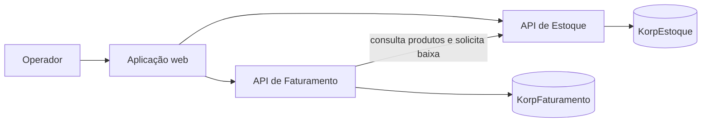
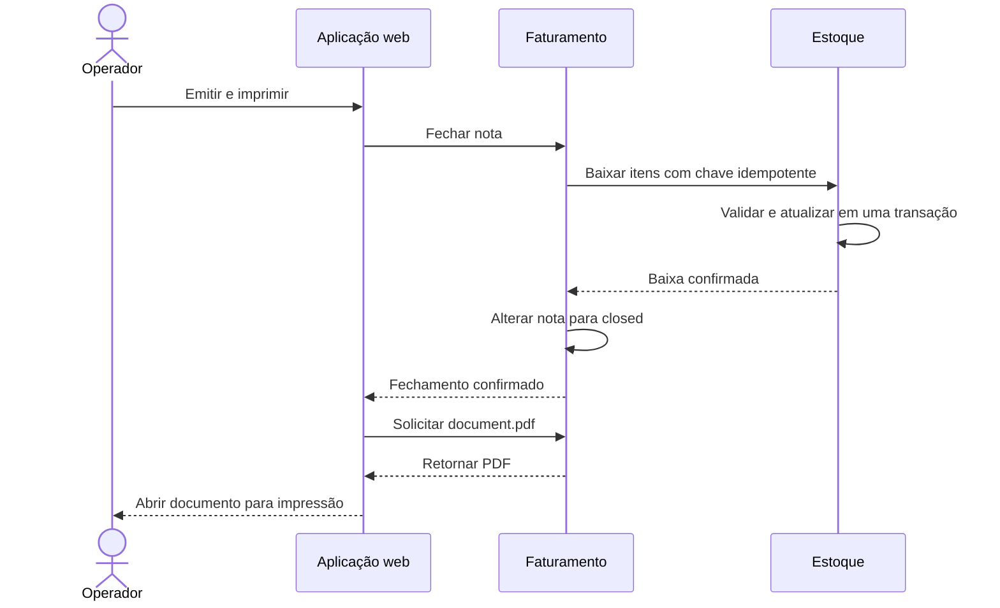
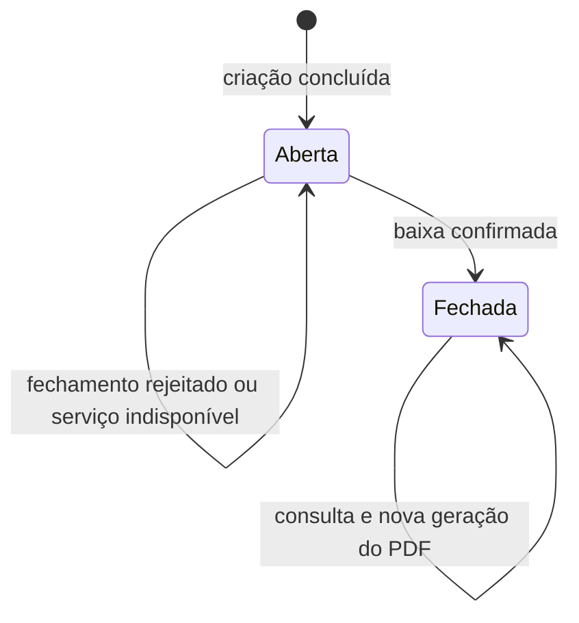

# Regras de negócio

## 1. Objetivo e escopo

Este documento descreve as regras de negócio efetivamente implementadas no sistema de emissão simplificada de notas e controle de estoque. O conteúdo reflete o comportamento atual das APIs de Estoque e Faturamento, da aplicação web, da persistência em SQL Server e dos testes automatizados.

As decisões de implementação e os detalhes de arquitetura estão documentados em [Detalhamento técnico](detalhamento-tecnico.md). As possibilidades de continuidade estão registradas em [Evolução](evolução.md).

Neste projeto, o termo **nota** representa um documento simplificado de saída de produtos. A solução não emite NF-e, não se integra à SEFAZ e não gera XML fiscal ou DANFE oficial.

## 2. Visão geral do negócio

O sistema atende ao seguinte fluxo:

1. o operador cadastra produtos e seus saldos iniciais;
2. cria uma nota com um ou mais produtos cadastrados;
3. solicita a emissão da nota;
4. o Faturamento solicita ao Estoque a baixa integral dos itens;
5. após a confirmação da baixa, a nota é fechada;
6. o PDF da nota fechada é gerado sob demanda e aberto para impressão.

Três invariantes orientam o comportamento da solução:

- o saldo de um produto nunca pode ficar negativo;
- a baixa de uma nota deve ser integral, sem atualização parcial dos itens;
- a repetição da mesma intenção de fechamento não pode provocar uma segunda baixa.

## 3. Contextos e responsabilidades

### 3.1. Estoque

O contexto de Estoque é proprietário dos produtos, dos saldos e das operações de baixa. Suas responsabilidades são:

- cadastrar e consultar produtos;
- listar produtos com saldo disponível;
- validar solicitações de baixa;
- atualizar os saldos de forma transacional e segura sob concorrência;
- registrar e reconhecer operações idempotentes.

### 3.2. Faturamento

O contexto de Faturamento é proprietário das notas e de seus itens. Suas responsabilidades são:

- validar os itens informados;
- confirmar no Estoque a existência dos produtos;
- gerar um número único e crescente para a nota;
- preservar o código e a descrição dos produtos como dados históricos;
- controlar os estados `open` e `closed`;
- coordenar a baixa do estoque antes do fechamento;
- gerar o PDF de notas fechadas.

Cada contexto possui banco de dados próprio. O Faturamento acessa o Estoque por HTTP e não consulta nem altera diretamente o banco do outro serviço.

## 4. Modelo de negócio

### 4.1. Produto

| Informação | Regra implementada |
|---|---|
| Identificador | Gerado pelo sistema e obrigatório. |
| Código | Obrigatório, único, limitado a 50 caracteres, sem espaços nas extremidades e armazenado em maiúsculas. |
| Descrição | Obrigatória, limitada a 200 caracteres e sem espaços nas extremidades. |
| Saldo | Número inteiro maior ou igual a zero. |
| Criação | Registrada no momento do cadastro. |
| Atualização | Registrada quando ocorre uma baixa de estoque. |

### 4.2. Nota

| Informação | Regra implementada |
|---|---|
| Identificador | Gerado pelo sistema e obrigatório. |
| Número | Único, positivo e obtido de uma sequência crescente do SQL Server. |
| Estado | Criada como `open` e alterada para `closed` após a confirmação da baixa. |
| Itens | Pelo menos um item, sem repetição do mesmo produto. |
| Criação | Registrada quando a nota é persistida. |
| Fechamento | Registrado somente após a baixa confirmada pelo Estoque. |

A sequência garante números únicos e crescentes, mas não numeração sem lacunas. Uma tentativa interrompida depois de reservar um número pode deixar um intervalo, comportamento compatível com sequências de banco de dados.

### 4.3. Item da nota

Cada item contém:

- identificador próprio;
- identificador do produto no Estoque;
- código e descrição copiados no momento da criação da nota;
- quantidade inteira maior que zero.

O código e a descrição são snapshots. Assim, a nota mantém a representação histórica do produto sem depender de consultas futuras ao cadastro de Estoque.

### 4.4. Operação de baixa

O Estoque registra cada baixa concluída com:

- identificador da operação;
- chave de idempotência;
- identificador da nota;
- hash canônico do conteúdo solicitado;
- data e hora do processamento.

## 5. Regras de produtos e estoque

| Código | Regra |
|---|---|
| EST-01 | Um produto somente pode ser cadastrado com código e descrição válidos e saldo inicial não negativo. |
| EST-02 | O código normalizado do produto deve ser único. Cadastros concorrentes com o mesmo código também devem ser rejeitados. |
| EST-03 | A consulta de produtos disponíveis retorna somente produtos com saldo maior que zero. |
| EST-04 | Uma solicitação de baixa deve informar uma nota válida, uma chave de idempotência válida e pelo menos um item. |
| EST-05 | A chave deve seguir o formato estável `invoice:{invoiceId}:close:v1` e corresponder à nota informada. |
| EST-06 | A mesma solicitação não pode repetir um produto e toda quantidade deve ser maior que zero. |
| EST-07 | Todos os produtos da solicitação devem existir. |
| EST-08 | Todos os produtos devem possuir saldo suficiente no momento efetivo da baixa. |
| EST-09 | A baixa de todos os itens e o registro da operação pertencem à mesma transação. Se um item falhar, toda a operação é revertida. |
| EST-10 | A atualização do saldo é condicional a `saldo >= quantidade`, impedindo saldo negativo mesmo com requisições concorrentes. |
| EST-11 | A repetição da mesma chave com a mesma nota e o mesmo conteúdo retorna a operação já processada sem nova baixa. |
| EST-12 | A reutilização da chave com nota ou conteúdo diferente é rejeitada como conflito de idempotência. |

## 6. Regras de criação e consulta de notas

| Código | Regra |
|---|---|
| FAT-01 | Uma nota deve ser criada com pelo menos um item. |
| FAT-02 | Cada item deve identificar um produto e informar quantidade maior que zero. |
| FAT-03 | O mesmo produto não pode aparecer mais de uma vez na mesma nota. |
| FAT-04 | Todos os produtos devem existir no Estoque no momento da criação. |
| FAT-05 | A criação não reserva estoque nem exige saldo suficiente; essa verificação ocorre no fechamento. |
| FAT-06 | Código e descrição dos produtos são copiados para os itens antes da persistência. |
| FAT-07 | Toda nota é criada no estado `open`. |
| FAT-08 | A nota recebe número único e crescente gerado pelo sistema. |
| FAT-09 | As notas podem ser listadas em ordem decrescente de número e filtradas por estado. |
| FAT-10 | A versão atual não permite adicionar, remover ou alterar itens depois que a nota foi criada. |

## 7. Regras de fechamento e documento

| Código | Regra |
|---|---|
| FEC-01 | Somente uma nota existente e aberta pode iniciar o fechamento. |
| FEC-02 | O Faturamento deve usar sempre a mesma chave de idempotência para as tentativas de fechamento de uma nota. |
| FEC-03 | A nota somente pode ser fechada depois que o Estoque confirmar a baixa ou reconhecer que a mesma baixa já foi processada. |
| FEC-04 | Produto inexistente, saldo insuficiente, conflito de idempotência ou indisponibilidade do Estoque mantêm a nota aberta. |
| FEC-05 | Uma nota fechada não pode ser fechada novamente. A tentativa é rejeitada antes de chamar o Estoque. |
| FEC-06 | O PDF somente pode ser gerado para uma nota fechada. |
| FEC-07 | O PDF é gerado sob demanda e pode ser consultado novamente sem alterar a nota ou o estoque. |
| FEC-08 | Falha na geração ou abertura do PDF não desfaz o fechamento já confirmado. |

O botão **Emitir e imprimir** executa duas operações em sequência: primeiro fecha a nota; depois solicita o PDF. O documento não é a causa técnica da baixa, e sua geração pode ser repetida com segurança.

## 8. Ciclo de vida da nota

Não existem, na versão atual, estados intermediários persistidos, edição, reabertura, cancelamento ou estorno de nota.

## 9. Atomicidade, concorrência e idempotência

### 9.1. Atomicidade local

O Estoque processa os itens em uma única transação. O registro idempotente é incluído na mesma transação das alterações de saldo. Se qualquer produto não existir ou não possuir saldo, ocorre rollback e nenhum item permanece debitado.

### 9.2. Concorrência

Cada saldo é alterado por uma atualização condicional executada no SQL Server. Se duas notas disputarem a última unidade, somente uma atualização afeta o produto; a outra operação recebe saldo insuficiente. O resultado obrigatório é um único sucesso e saldo final igual a zero.

### 9.3. Recuperação após resposta perdida

É possível que o Estoque confirme a transação, mas a resposta não chegue ao Faturamento. Nesse caso, a nota permanece aberta enquanto o saldo já foi alterado. Uma nova tentativa utiliza a mesma chave; o Estoque reconhece o conteúdo, não repete a baixa e permite que o Faturamento conclua o fechamento.

## 10. Tratamento das principais falhas

| Situação | Resultado |
|---|---|
| Código de produto duplicado | Cadastro rejeitado; o produto existente não é alterado. |
| Produto inexistente ao criar a nota | Nota não criada. |
| Estoque indisponível ao criar a nota | Nota não criada e indisponibilidade informada. |
| Produto inexistente ao fechar | Nota permanece aberta e nenhuma baixa parcial é mantida. |
| Saldo insuficiente ao fechar | Nota permanece aberta e toda a baixa é revertida. |
| Estoque indisponível ou timeout | Nota permanece aberta e a tentativa pode ser repetida. |
| Resposta perdida após a baixa | Nova tentativa reconhece a operação anterior e não debita novamente. |
| Chave idempotente reutilizada com outro conteúdo | Operação rejeitada por conflito. |
| Nota já fechada | Novo fechamento rejeitado sem chamada ao Estoque. |
| PDF solicitado para nota aberta | Solicitação rejeitada por conflito de estado. |
| Erro ao gerar o PDF | Fechamento preservado e falha do documento informada separadamente. |

## 11. Experiência do operador

A aplicação web implementa os seguintes comportamentos:

- desabilita a ação de emissão enquanto o fechamento está em andamento;
- apresenta indicador de processamento;
- exibe mensagens de sucesso, validação, conflito e indisponibilidade;
- mantém a nota aberta na interface quando o fechamento falha;
- atualiza a nota para fechada antes de solicitar o PDF;
- permite abrir novamente o documento de uma nota fechada;
- impede a seleção duplicada do mesmo produto na composição da nota.

## 12. Limites funcionais atuais

Não fazem parte da implementação:

- autenticação, autorização, usuários e perfis;
- clientes, fornecedores, transportadoras, empresas ou filiais;
- preços, descontos, totais financeiros, pagamentos e cálculo tributário;
- NF-e, integração com SEFAZ, XML fiscal e DANFE oficial;
- edição de produtos ou de notas;
- entrada, ajuste, reserva ou histórico completo de movimentações de estoque;
- cancelamento, reabertura ou estorno de notas fechadas;
- retentativas automáticas, circuit breaker ou mensageria;
- transação distribuída entre os bancos de Estoque e Faturamento.

Esses itens são possibilidades de evolução e somente devem ser incorporados mediante requisitos de negócio, segurança e operação claramente definidos.

## 13. Evidências automatizadas

As regras críticas possuem cobertura específica em testes unitários e de integração com SQL Server real:

- validações e invariantes de Produto, Nota, Item e Operação de Estoque;
- unicidade do código do produto e do número da nota;
- persistência da nota com múltiplos itens;
- baixa integral e rollback por saldo insuficiente;
- idempotência com repetição igual e conflito de conteúdo;
- concorrência pela última unidade;
- recuperação depois da perda da resposta do Estoque;
- geração de PDF para nota fechada.

Os testes de integração utilizam bancos descartáveis por meio de Testcontainers, permitindo validar constraints, migrations, transações e concorrência nas mesmas características do banco adotado pela aplicação.
